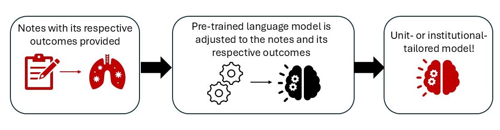

# Joint finetuning

Joint (semi-supervised) single-outcome finetuning trains a separate model for each postoperative outcome of interest. The model jointly learns the structure of your clinical notes while learning to predict the outcome, ensuring it captures both the linguistic patterns of your institution's documentation style and the clinical features that drive your specific outcome. Unlike [multi-task finetuning](multitask_finetuning.md), this workflow is catered to a single specific outcome rather than multiple outcomes.



## `joint_finetune`

!!! note ""

    surgicalplan.**joint_finetune**(*df, text_col, outcome_col, output_dir="joint_finetuned", base_model="emilyalsentzer/Bio_ClinicalBERT", hf_token=None, max_length=512, lambda_constant=2, mlm_probability=0.15, val_fraction=1/8, weight=None, training_configs=None*)

Fine-tune `Bio+ClinicalBERT` (or any encoder / BERT-based model) on self-supervised loss jointly with a single binary classification head for one outcome.

### Parameters

- `df` (*pandas.DataFrame*, **required**): Must contain `text_col` and `outcome_col`.
- `text_col` (*str*, **required**): Name of the free-text column.
- `outcome_col` (*str*, **required**): Name of a single binary (0/1) outcome column. Rows with NaN in this column are dropped before training.
- `output_dir` (*str*, optional): Directory to save the fine-tuned model, tokenizer, and metadata. Also used as the HuggingFace Trainer `output_dir` for checkpoints and logs. Defaults to `"joint_finetuned"`.
- `base_model` (*str*, optional): HuggingFace model id to start from. Any BERT-architecture model should work. Defaults to `"emilyalsentzer/Bio_ClinicalBERT"`.
- `hf_token` (*str | None*, optional): Optional HuggingFace token for gated/private base models. If `None`, uses the cached CLI login when present.
- `max_length` (*int*, optional): Token sequence length for tokenization. Defaults to `512`.
- `lambda_constant` (*float*, optional): Weight on the auxiliary (BCE) loss relative to MLM loss. Total loss = MLM + λ · BCE. Defaults to `2`.
- `mlm_probability` (*float*, optional): Token masking probability for MLM. Defaults to `0.15`.
- `val_fraction` (*float*, optional): Fraction of `df` held out for validation during training. Defaults to `1/8`.
- `weight` (*torch.Tensor | None*, optional): Optional `pos_weight` for `BCEWithLogitsLoss` to handle class imbalance. Useful for rare outcomes (e.g., `torch.tensor([20.0])` for ~5% positive prevalence). Defaults to `None`.
- `training_configs` (*dict | None*, optional): Any keyword arguments accepted by `transformers.TrainingArguments`. User-provided values override the defaults. Defaults to `None`, in which case the defaults below are used.

??? note "Default `training_configs`"

    ```python
    {
        "num_train_epochs": 5,
        "per_device_train_batch_size": 24,
        "per_device_eval_batch_size": 24,
        "learning_rate": 1e-5,
        "warmup_ratio": 0.06,
        "weight_decay": 1e-3,
        "logging_steps": 1000,
        "save_strategy": "epoch",
        "seed": 42,
        "report_to": "none",
    }
    ```

### Returns

`str` — the `output_dir` path. After training, this directory contains:

- `pytorch_model.bin` (or `model.safetensors`) — model weights
- `config.json` — model architecture config
- `tokenizer.json`, `vocab.txt`, `tokenizer_config.json`, `special_tokens_map.json` — tokenizer
- `joint_metadata.json` — records `outcome_col`, `text_col`, `max_length`, `base_model`, `lambda_constant`, `num_tasks` (always 1), and `workflow`, so inference can recover them automatically
- `checkpoint-*` — per-epoch training checkpoints (can be deleted after training)
- `logs/` — TensorBoard-compatible training logs

### Example

```python
from surgicalplan import joint_finetune

joint_finetune(
    df,
    text_col="clinical_note",
    outcome_col="DVT",
    output_dir="DVT_model",
    training_configs={
        "num_train_epochs": 3,
        "per_device_train_batch_size": 16,
        "evaluation_strategy": "steps",
        "eval_steps": 100,
        "logging_steps": 100,
        "learning_rate": 2e-5,
    },
)
```

For a rare outcome, supply a positive-class weight to address class imbalance:

```python
import torch

joint_finetune(
    df,
    text_col="clinical_note",
    outcome_col="PE",
    output_dir="PE_model",
    weight=torch.tensor([20.0]),  # ~5% positive prevalence
)
```

---

## `get_outcome_score`

!!! note ""

    surgicalplan.**get_outcome_score**(*model_name, text, max_length=None, device=None, hf_token=None*)

Score a text scenario (or list of scenarios) against the single auxiliary head of a joint-finetuned model.

### Parameters

- `model_name` (*str*, **required**): Path to a directory saved by `joint_finetune`.
- `text` (*str | list[str]*, **required**): One scenario string, or a list of them. Determines the shape of the return value.
- `max_length` (*int | None*, optional): Token sequence length. Defaults to the value used during fine-tuning, recovered from `joint_metadata.json`, otherwise `512`.
- `device` (*str | None*, optional): `"cuda"`, `"cpu"`, or `None` to auto-detect.
- `hf_token` (*str | None*, optional): Optional HuggingFace token for gated/private models.

### Returns

- `float` when `text` is a string — the predicted probability for the trained outcome, in `[0, 1]`.
- `list[float]` when `text` is a list — one probability per input, in the same order.

### Example

```python
from surgicalplan import get_outcome_score

prob = get_outcome_score(
    model_name="DVT_model",
    text="83-year-old male, ASA 4, scheduled for CABG. PMH: COPD, diabetes.",
)
print(prob)
# 0.23
```
