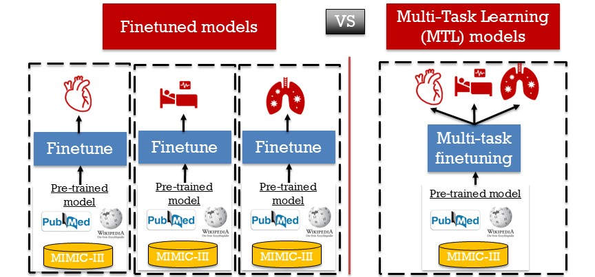

# Multi-task finetuning

Multi-task learning (MTL) allows you to train a single versatile model capable of predicting multiple postoperative outcomes from the same clinical notes. Unlike traditional finetuning strategies — where you would need to train a separate model for each outcome — MTL lets you create one model capable of simultaneously predicting multiple risks, analogous to a foundation model.



## `mtl_finetune`

!!! note ""

    surgicalplan.**mtl_finetune**(*df, text_col, outcome_cols, output_dir="mtl_finetuned", base_model="emilyalsentzer/Bio_ClinicalBERT", hf_token=None, max_length=512, lambda_constant=2, mlm_probability=0.15, val_fraction=1/8, weights=None, training_configs=None*)

Fine-tune Bio+ClinicalBERT on masked language modeling (MLM) jointly with one binary classification head per outcome.

### Parameters

- `df` (*pandas.DataFrame*, **required**): Must contain `text_col` and all `outcome_cols`.
- `text_col` (*str*, **required**): Name of the free-text column.
- `outcome_cols` (*list[str]*, **required**): Names of binary (0/1) outcome columns. One auxiliary head is trained per outcome. Rows with NaN in a given outcome are dropped for that outcome's task but used for the others.
- `output_dir` (*str*, optional): Directory to save the fine-tuned model, tokenizer, and metadata. Also used as the HuggingFace Trainer `output_dir` for checkpoints and logs. Defaults to `"mtl_finetuned"`.
- `base_model` (*str*, optional): HuggingFace model id to start from. Any BERT-architecture model should work. Defaults to `"emilyalsentzer/Bio_ClinicalBERT"`.
- `hf_token` (*str | None*, optional): Optional HuggingFace token for gated/private base models. If `None`, uses the cached CLI login when present.
- `max_length` (*int*, optional): Token sequence length for tokenization. Defaults to `512`.
- `lambda_constant` (*float*, optional): Weight on the auxiliary (per-outcome BCE) loss relative to MLM loss. Total loss = MLM + λ · mean(per-task BCE). Defaults to `2`.
- `mlm_probability` (*float*, optional): Token masking probability for MLM. Defaults to `0.15`.
- `val_fraction` (*float*, optional): Fraction of `df` held out for validation during training. Defaults to `1/8`.
- `weights` (*torch.Tensor | None*, optional): Optional per-task `pos_weight` for `BCEWithLogitsLoss` to handle class imbalance across the multiple outcomes. Defaults to `None`.
- `training_configs` (*dict | None*, optional): Any keyword arguments accepted by `transformers.TrainingArguments`. User-provided values override the defaults. Defaults to `None`, in which case the defaults below are used.

??? note "Default `training_configs`"

    ```python
    {
        "num_train_epochs": 5,
        "per_device_train_batch_size": 24,
        "per_device_eval_batch_size": 24,
        "learning_rate": 1e-5,
        "warmup_ratio": 0.06,
        "weight_decay": 1e-3,
        "logging_steps": 1000,
        "save_strategy": "epoch",
        "seed": 42,
        "report_to": "none",
    }
    ```

### Returns

`str` — the `output_dir` path. After training, this directory contains:

- `pytorch_model.bin` (or `model.safetensors`) — model weights
- `config.json` — model architecture config
- `tokenizer.json`, `vocab.txt`, `tokenizer_config.json`, `special_tokens_map.json` — tokenizer
- `mtl_metadata.json` — records `outcome_cols`, `text_col`, `max_length`, `base_model`, `lambda_constant`, `num_tasks`, so inference can recover them automatically
- `checkpoint-*` — per-epoch training checkpoints (can be deleted after training)
- `logs/` — TensorBoard-compatible training logs

### Example

```python
from surgicalplan import mtl_finetune

mtl_finetune(
    df,
    text_col="clinical_notes",
    outcome_cols=["death_30d", "dvt", "pneumonia", "aki", "AUR", "PE"],
    output_dir="my_run",
    training_configs={
        "num_train_epochs": 3,
        "per_device_train_batch_size": 16,
        "evaluation_strategy": "steps",
        "eval_steps": 100,
        "logging_steps": 100,
        "learning_rate": 2e-5,
    },
)
```

---

## `get_postoperative_outcome_scores`

!!! note ""

    surgicalplan.**get_postoperative_outcome_scores**(*model_name, text, outcomes=None, max_length=None, device=None, hf_token=None*)

Score a text scenario (or list of scenarios) against each auxiliary head of a fine-tuned MTL model.

### Parameters

- `model_name` (*str*, **required**): Path to a directory saved by `mtl_finetune`.
- `text` (*str | list[str]*, **required**): One scenario string, or a list of them. Determines the shape of the return value.
- `outcomes` (*list[str] | None*, optional): Which outcomes to score. Defaults to all outcomes the model was trained on, recovered from `mtl_metadata.json`. Pass a subset to score only some. Names must match those used in `mtl_finetune`.
- `max_length` (*int | None*, optional): Token sequence length. Defaults to the value used during fine-tuning, recovered from metadata, otherwise `512`.
- `device` (*str | None*, optional): `"cuda"`, `"cpu"`, or `None` to auto-detect.
- `hf_token` (*str | None*, optional): Optional HuggingFace token for gated/private models.

### Returns

- `dict[str, float]` when `text` is a string — maps each outcome name to a probability in `[0, 1]`.
- `list[dict[str, float]]` when `text` is a list — one dict per input, in the same order.

### Example

```python
from surgicalplan import get_postoperative_outcome_scores

scores = get_postoperative_outcome_scores(
    model_name="my_run",
    text="83-year-old male, ASA 4, scheduled for CABG. PMH: COPD, diabetes.",
    outcomes=["death_30d", "dvt", "pneumonia", "aki", "AUR", "PE"],
)
print(scores)
# {'death_30d': 0.31, 'dvt': 0.12, 'pneumonia': 0.20,
#  'aki': 0.44, 'AUR': 0.08, 'PE': 0.05}
```

---

## `get_pseudo_data`

!!! note ""

    surgicalplan.**get_pseudo_data**()

Generate a small synthetic dataset of preoperative clinical notes with binary outcomes for testing and demonstration. Outcomes are not random — each is driven by realistic feature combinations in the note (procedure type, age, ASA class, comorbidities), so a fine-tuned model is expected to learn meaningful associations.

### Parameters

None.

### Returns

`pandas.DataFrame` with 1000 rows and 5 columns:

- `text` (*str*) — synthetic preoperative note.
- `Outcome_1` to `Outcome_4` (*int*, 0/1) — binary outcomes driven by clinical features in the note.

### Example

```python
from surgicalplan import get_pseudo_data

df = get_pseudo_data()
print(df.shape)             # (1000, 5)
print(df.columns.tolist())  # ['text', 'Outcome_1', 'Outcome_2', 'Outcome_3', 'Outcome_4']
```

See the [Examples](../examples.md) page for a full end-to-end demonstration using this synthetic dataset.
